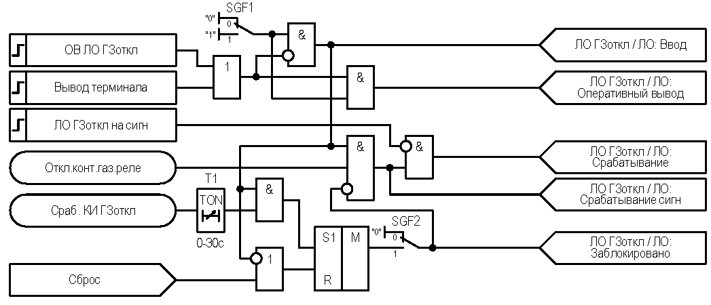

# Внешний осмотр {#sec:vnesh} 

Смотри таблицу @tbl:table1.
Произведен внешний осмотр устройства «ЮНИТ-М300-ДЗТ2», на предмет:

- отсутствия повреждений, подтеков воды, в том числе, высохших;
- отсутствия налета окислов на металлических поверхностях, отсутствия запыленности;
- состояния контактных поверхностей клемм рядов зажимов, в клеммных коробках и сборках (протяжка при необходимости), разъемов интерфейса связи;
- отсутствия механических повреждений элементов управления;
- соответствия типов, установленных в шкафу аппаратов заводской спецификации и проектной документации (производится только при новом включении устройства);
- правильности выполнения концевых разделок контрольных кабелей, уплотнений проходных отверстий;
- состояния уплотнений дверей шкафов, кожухов, вторичных выводов трансформаторов тока и напряжения, кабельных вводов, крышек технологических отверстий и т.п.;
- состояния и правильности выполнения заземлений цепей вторичных соединений и аппаратуры устройства;
- наличия и правильности надписей на элементах устройства и соответствие их функциональному назначению, наличие и правильность маркировки кабелей, жил кабелей и проводов.

Смотри таблицу @tbl:table1.

$$
f = \frac{a}{b}
$$

|Номер|Количество|Гавно|Еще Гавно|
|-----|----------|-----|---------|
|1    |5         |да   |да       |

: Таблица гавна {#tbl:table1}

{#fig:image1}